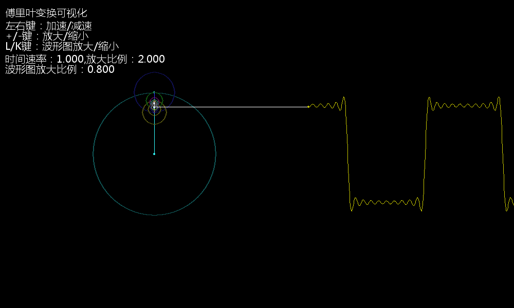

# Fourier-visualization
傅里叶变换可视化

效果图：



##  配置

使用了pygame
```shell
pip3 install pygame
or
pip3 install pygame -i https://mirrors.aliyun.com/pypi/simple
```

因为我电脑的屏幕分辨率比较小，所以你可能需要修改一些参数来适应屏幕。


## 运行
```shell
python3 fuliye.py
```

运行后可以：
* 左右键：加速/减速
* +/-键：放大/缩小
* L/K键：波形图放大/缩小

### 函数
将你想要显示的波形函数以这种形式写在fourier_list（代码中第37行）中。
例如：
```
f(x) = 1*sin(x) + (1/3)*sin(3x) + (1/5)*sin(5x) + ...
```
这是一个方形波
我们将其参数写在fourier_list中。
```python
fourier_list = [
    [1    ,  1, 0],
    [1 / 3,  3, 0],
    [1 / 5,  5, 0],
    [1 / 7,  7, 0],
    [1 / 9,  9, 0],
    [1 /11, 11, 0],
    [1 /13, 13, 0],
    [1 /15, 15, 0],
    [1 /17, 17, 0],
    [1 /19, 19, 0]
]
```
当然，你也可以继续追加，让它更逼近方形波。

或者这样：
```python
fourier_list = []
for i in range(1,1000,2):
    fourier_list.append([1/i,i,0])
```

还有锯齿波：
```python
fourier_list = []
for i in range(1,1000,1):
    fourier_list.append([1/i,i,0])
```
